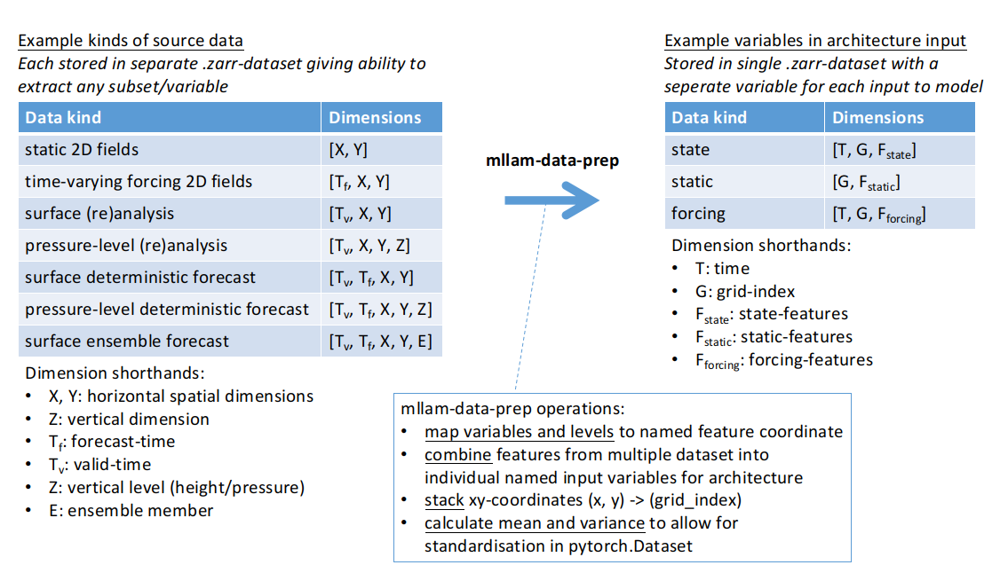
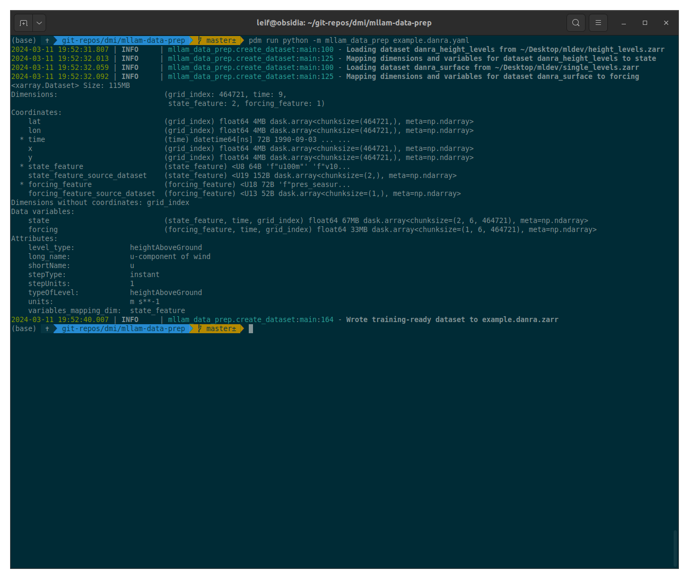
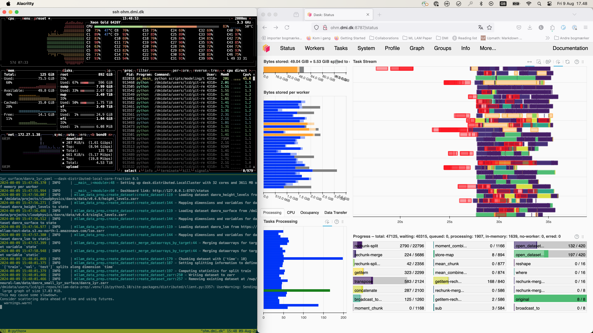

# mllam-data-prep

This package aims to be a *declarative* way to prepare training-data for data-driven (i.e. machine learning) weather forecasting models.
A training dataset is constructed by declaring in a yaml configuration file (for example [example.danra.yaml](example.danra.yaml)) the data sources, the variables to extract, the transformations to apply to the data, and the target variable(s) of the model architecture to map the data to.



The configuration is principally a means to represent how the dimensions of a given variable in a source dataset should be mapped to the dimensions and input variables of the model architecture to be trained.

The configuration is given in yaml-format and the file specification is defined using python3 [dataclasses](https://docs.python.org/3/library/dataclasses.html) (serialised to yaml using [dataclasses-wizard](https://dataclass-wizard.readthedocs.io/en/latest/)) and defined in [mllam_data_prep/config.py](mllam_data_prep/config.py).


## Installation

To simply use `mllam-data-prep` you can install the most recent tagged version from pypi with pip:

```bash
python -m pip install mllam-data-prep
```

If you want support for [creating datasets in parallel using `dask.distributed`](#creating-large-datasets-with-daskdistributed) you can install the package with the `dask-distributed` extra:

```bash
python -m pip install mllam-data-prep[dask-distributed]
```

## Developing `mllam-data-prep`

To work on developing `mllam-data-prep` it easiest to install and manage the dependencies with [pdm](https://pdm.fming.dev/). To get started clone your fork of [the main repo](https://github.com/mllam/mllam-data-prep) locally:

```bash
git clone https://github.com/<your-github-username>/mllam-data-prep
cd mllam-data-prep
```

Use pdm to create and use a virtualenv:

```bash
pdm venv create
pdm use --venv in-project
pdm install
```

All the linting is handelled by `pre-commit` which can be setup to automatically be run on each `git commit` by installing the git commit hook:

```bash
pdm run pre-commit install
```

Then branch, commit, push and make a pull-request :)


## Usage

The package is designed to be used as a command-line tool. The main command is `mllam-data-prep` which takes a configuration file as input and outputs a training dataset in the form of a `.zarr` dataset named from the config file (e.g. `example.danra.yaml` produces `example.danra.zarr`).
The format for the [config is described below](#configuration-file).
The package can also be used as a python module to create datasets in a more programmatic way by calling `mllam_data_prep.create_dataset()` directly (see below).

### Command-line usage

```bash
mllam_data_prep example.danra.yaml
```

Example output:




#### Creating large datasets (with `dask.distributed`)

If you will be creating datasets larger than a few 100MB you may want to use
`dask.distributed.LocalCluster` to parallelise the creation of the dataset. This can be done
by setting the ` --dask-distributed-local-core-fraction` flag to a value
between `0.0` and `1.0`. This will create a local `dask.distributed` cluster with the
number of workers set to the number of cores on the machine multiplied by the
fraction given. For example, to use 50% of the cores on the machine you would
run:

```bash
mllam_data_prep example.danra.yaml --dask-distributed-local-core-fraction 0.5
```

Unfortunately, the number of cores to use can only be worked out by trial and
error, but a good starting point is to use 50% of the cores on the machine and
then if you notice warnings suggesting that workers are running out of memory
you should reduce the fraction of cores used (so that each worker has more
memory available).
You can also adjust the fraction of the total system memory allocated with
`--dask-distributed-local-memory-fraction` (default is `0.9`).

When you run the above command the console will print a URL to the dask
dashboard, which you can open in a browser to monitor the progress of the
dataset creation (and see the memory usage of the workers).



### Usage as a python module

The package can also be used as a python module to create datasets directly, for example to create training datasets during training. The main function to use is `mllam_data_prep.create_dataset(config)` which takes a `mllam_data_prep.Config` as input and returns a `xarray.Dataset` object. For example:

```python
import mllam_data_prep as mdp

config_path = "example.danra.yaml"
config = mdp.Config.from_yaml_file(config_path)
ds = mdp.create_dataset(config=config)
```

## Configuration file

A full example configuration file is given in [example.danra.yaml](example.danra.yaml), and reproduced here for completeness:

```yaml
schema_version: v0.6.0
dataset_version: v0.1.0

output:
  variables:
    static: [grid_index, static_feature]
    state: [time, grid_index, state_feature]
    forcing: [time, grid_index, forcing_feature]
  coord_ranges:
    time:
      start: 1990-09-03T00:00
      end: 1990-09-09T00:00
      step: PT3H
  chunking:
    time: 1
  splitting:
    dim: time
    splits:
      train:
        start: 1990-09-03T00:00
        end: 1990-09-06T00:00
        compute_statistics:
          ops: [mean, std, diff_mean, diff_std]
          dims: [grid_index, time]
      val:
        start: 1990-09-06T00:00
        end: 1990-09-07T00:00
      test:
        start: 1990-09-07T00:00
        end: 1990-09-09T00:00

inputs:
  danra_height_levels:
    path: https://object-store.os-api.cci1.ecmwf.int/mllam-testdata/danra_cropped/v0.2.0/height_levels.zarr
    dims: [time, x, y, altitude]
    variables:
      u:
        altitude:
          values: [100,]
          units: m
      v:
        altitude:
          values: [100, ]
          units: m
    dim_mapping:
      time:
        method: rename
        dim: time
      state_feature:
        method: stack_variables_by_var_name
        dims: [altitude]
        name_format: "{var_name}{altitude}m"
      grid_index:
        method: stack
        dims: [x, y]
    target_output_variable: state

  danra_surface:
    path: https://object-store.os-api.cci1.ecmwf.int/mllam-testdata/danra_cropped/v0.2.0/single_levels.zarr
    dims: [time, x, y]
    variables:
      # use surface incoming shortwave radiation as forcing
      - swavr0m
    derived_variables:
      # derive variables to be used as forcings
      toa_radiation:
        kwargs:
          time: ds_input.time
          lat: ds_input.lat
          lon: ds_input.lon
        function: mllam_data_prep.ops.derive_variable.physical_field.calculate_toa_radiation
      hour_of_day_sin:
        kwargs:
          time: ds_input.time
          component: sin
        function: mllam_data_prep.ops.derive_variable.time_components.calculate_hour_of_day
      hour_of_day_cos:
        kwargs:
          time: ds_input.time
          component: cos
        function: mllam_data_prep.ops.derive_variable.time_components.calculate_hour_of_day
    dim_mapping:
      time:
        method: rename
        dim: time
      grid_index:
        method: stack
        dims: [x, y]
      forcing_feature:
        method: stack_variables_by_var_name
        name_format: "{var_name}"
    coord_ranges:
      x:
        start: -170000
        end: -120000
      y:
        start: -600000
        end: -550000
    target_output_variable: forcing

  danra_static:
    path: https://object-store.os-api.cci1.ecmwf.int/mllam-testdata/danra_cropped/v0.2.0/single_levels.zarr
    dims: [x, y]
    variables:
      - lsm
      - orography
    dim_mapping:
      grid_index:
        method: stack
        dims: [x, y]
      static_feature:
        method: stack_variables_by_var_name
        name_format: "{var_name}"
    target_output_variable: static

extra:
  projection:
    class_name: LambertConformal
    kwargs:
      central_longitude: 25.0
      central_latitude: 56.7
      standard_parallels: [56.7, 56.7]
      globe:
        semimajor_axis: 6367470.0
        semiminor_axis: 6367470.0
```

Apart from identifiers to keep track of the configuration file format version and the dataset version (for you to keep track of changes that you make to the dataset), the configuration file is divided into two main sections:

- `output`: defines the variables and dimensions of the output dataset produced by `mllam-data-prep`. These are the variables and dimensions that the input datasets will be mapped to. These output variables and dimensions should match the input variables and dimensions expected by the model architecture you are training.
- `inputs`: a list of source datasets to extract data from. These are the datasets that will be mapped to the architecture defined in the `architecture` section.

If you want to add any extra information to the configuration file you can add it to the `extra` section. This section is not used or validated by `mllam-data-prep` but can be used to store any extra information you want to keep track of (for example when using `mllam-data-prep` with [neural-lam](https://github.com/mllam/neural-lam) the `extra` section is used to store the projection information).

### The `output` section

```yaml
output:
  variables:
    static: [grid_index, static_feature]
    state: [time, grid_index, state_feature]
    forcing: [time, grid_index, forcing_feature]
  coord_ranges:
    time:
      start: 1990-09-03T00:00
      end: 1990-09-09T00:00
      step: PT3H
  chunking:
    time: 1
  splitting:
    dim: time
    splits:
      train:
        start: 1990-09-03T00:00
        end: 1990-09-06T00:00
        compute_statistics:
          ops: [mean, std, diff_mean, diff_std]
          dims: [grid_index, time]
      val:
        start: 1990-09-06T00:00
        end: 1990-09-07T00:00
      test:
        start: 1990-09-07T00:00
        end: 1990-09-09T00:00
```

The `output` section defines three things:

1. `variables`: what input variables the model architecture you are targeting expects, and what the dimensions are for each of these variables.
2. `coord_ranges`: the range of values for each of the dimensions that the model architecture expects as input. These are optional, but allows you to ensure that the training dataset is created with the correct range of values for each dimension.
3. `chunking`: the chunk sizes to use when writing the training dataset to zarr. This is optional, but can be used to optimise the performance of the zarr dataset. By default the chunk sizes are set to the size of the dimension, but this can be overridden by setting the chunk size in the configuration file. A common choice is to set the dimension along which you are batching to align with the of each training item (e.g. if you are training a model with time-step roll-out of 10 timesteps, you might choose a chunksize of 10 along the time dimension).
4. Splitting and calculation of statistics of the output variables, using the `splitting` section. The `output.splitting.splits` attribute defines the individual splits to create (for example `train`, `val` and `test`) and `output.splitting.dim` defines the dimension to split along. The `compute_statistics` can be optionally set for a given split to calculate the statistical properties requested (for example `mean`, `std`) any method available on `xarray.Dataset.{op}` can be used. In addition methods prefixed by `diff_` (so the operational would be listed as `diff_{op}`) to compute a statistic based on difference of consecutive time-steps, e.g. `diff_mean` to compute the `mean` of the difference between consecutive timesteps (these are used for normalisating increments). The `dims` attribute defines the dimensions to calculate the statistics over (for example `grid_index` and `time`).

### The `inputs` section

```yaml
inputs:
  danra_height_levels:
    path: https://object-store.os-api.cci1.ecmwf.int/mllam-testdata/danra_cropped/v0.2.0/height_levels.zarr
    dims: [time, x, y, altitude]
    variables:
      u:
        altitude:
          values: [100,]
          units: m
      v:
        altitude:
          values: [100, ]
          units: m
    dim_mapping:
      time:
        method: rename
        dim: time
      state_feature:
        method: stack_variables_by_var_name
        dims: [altitude]
        name_format: "{var_name}{altitude}m"
      grid_index:
        method: stack
        dims: [x, y]
    target_output_variable: state

  danra_surface:
    path: https://object-store.os-api.cci1.ecmwf.int/mllam-testdata/danra_cropped/v0.2.0/single_levels.zarr
    dims: [time, x, y]
    variables:
      # use surface incoming shortwave radiation as forcing
      - swavr0m
    derived_variables:
      # derive variables to be used as forcings
      toa_radiation:
        kwargs:
          time: ds_input.time
          lat: ds_input.lat
          lon: ds_input.lon
        function: mllam_data_prep.ops.derive_variable.physical_field.calculate_toa_radiation
      hour_of_day_sin:
        kwargs:
          time: ds_input.time
          component: sin
        function: mllam_data_prep.ops.derive_variable.time_components.calculate_hour_of_day
      hour_of_day_cos:
        kwargs:
          time: ds_input.time
          component: cos
        function: mllam_data_prep.ops.derive_variable.time_components.calculate_hour_of_day
    dim_mapping:
      time:
        method: rename
        dim: time
      grid_index:
        method: stack
        dims: [x, y]
      forcing_feature:
        method: stack_variables_by_var_name
        name_format: "{var_name}"
    coord_ranges:
      x:
        start: -170000
        end: -120000
      y:
        start: -600000
        end: -550000
    target_output_variable: forcing

  ...
```

The `inputs` section defines the source datasets to extract data from. Each source dataset is defined by a key (e.g. `danra_height_levels`) which names the source dataset, and the attributes of the source dataset:

- `path`: the path to the source dataset. This can be a local path or a URL to e.g. a zarr dataset or netCDF file, anything that can be read by `xarray.open_dataset(...)`.
- `dims`: the dimensions that the source dataset is expected to have. This is used to check that the source dataset has the expected dimensions and also makes it clearer in the config file what the dimensions of the source dataset are.
- `variables`: selects which variables to extract from the source dataset. This may either be a list of variable names, or a dictionary where each key is the variable name and the value defines a dictionary of coordinates to do selection on. When doing selection you may also optionally define the units of the variable to check that the units of the variable match the units of the variable in the model architecture.
- `target_output_variable`: the variable in the model architecture that the source dataset should be mapped to.
- `dim_mapping`: defines how the dimensions of the source dataset should be mapped to the dimensions of the model architecture. This is done by defining a method to apply to each dimension. The methods are:
  - `rename`: simply rename the dimension to the new name
  - `stack`: stack the listed dimension to create the dimension in the output
  - `stack_variables_by_var_name`: stack the dimension into the new dimension, and also stack the variable name into the new variable name. This is useful when you have multiple variables with the same dimensions that you want to stack into a single variable.
- `derived_variables`: defines the variables to be derived from the variables available in the source dataset. This should be a dictionary where each key is the name of the variable to be derived and the value defines a dictionary with the following additional information. See also the 'Derived Variables' section for more details.
  - `function`: the function used to derive a variable. This should be a string with the full namespace of the function, e.g. `mllam_data_prep.ops.derived_variables.physical_field.calculate_toa_radiation`.
  - `kwargs`: arguments to `function`. This is a dictionary where each key is the named argument to `function` and each value is the input to the function. Here we distinguish between values to be extracted/selected from the input dataset and values supplied by the users themselves. Arguments with values to be extracted from the input dataset need to be prefixed with "ds_input." to distinguish them from other arguments. See the 'Derived Variables' section for more details.
  - `coord_ranges`
    - `varable` : the variable to extract the coordinate from
        `start`: start value of the variable
        `end`: end value of the variable

#### Derived Variables
Variables that are not part of the source dataset but can be derived from variables in the source dataset can also be included. They should be defined in their own section, called `derived_variables` as illustrated in the example config above and in the example config file [example.danra.yaml](example.danra.yaml).

To derive a variable, the function to be used (`function`) and the arguments to this function (`kwargs`) need to be specified, as explained above. Here we need to distinguish between arguments that should be data from the input dataset and arguments that should be supplied by the users themselves. The example below illustrates how to derive the cosine component of the cyclically encoded hour of day variable

```yaml
    derived_variables:
      hour_of_day_cos:
        kwargs:
          time: ds_input.time
          component: cos
        function: mllam_data_prep.ops.derive_variable.time_components.calculate_hour_of_day
        attrs:
          units: 1
          long_name: cos component of cyclically encoded hour of day
```

The function `mllam_data_prep.ops.derive_variable.time_components.calculate_hour_of_day` takes two arguments; `time` and `component`. The `time` argument should extract the `time` variable from the input dataset and has therefore been prefixed with "ds_input." to distinguish it from other arguments that should not  be extracted from the source dataset. The `component` argument, on the other hand, is a string (either "sin" or "cos") and decides if the returned derived variable is the sine or cosine component of the cyclically encoded hour of day.

In addition, an optional section called `attrs` can be added. In this section, the user can add attributes to the derived variable, as illustrated in the example above. Note that the attributes `units` and `long_name` are **required**. This means that if the function used to derive a variable does not set these attributes they are **required** to be set in the config file. If using a function defined in `mllam_data_prep.ops.derive_variable` the `attrs` section is optional as the required attributes should already be defined. In this case, adding the `units` and `long_name` attributes to the `attrs` section of the derived variable in config file will **overwrite** the already-defined attributes in the function. It is also possible to set other attributes. This can be done by adding them under the `attrs` section in the same way as shown for `unit` and `long_name` in the example above.

Currently, the following derived variables are included as part of `mllam-data-prep`:
- `toa_radiation`:
  - Top-of-atmosphere incoming radiation
  - function: `mllam_data_prep.ops.derive_variable.physical_field.calculate_toa_radiation`
  - arguments: `lat`, `lon`, `time`
- `hour_of_day_[sin/cos]`:
  - Sine or cosine part of cyclically encoded hour of day
  - function: `mllam_data_prep.ops.derive_variable.time_components.calculate_hour_of_day`
  - arguments: `time`, `component`
- `day_of_year_[sin/cos]`:
  - Sine or cosine part of cyclically encoded day of year
  - function: `mllam_data_prep.ops.derive_variable.time_components.calculate_day_of_year`
  - arguments: `time`, `component`


### Config schema versioning

The schema version of the configuration file is defined by the `schema_version` attribute at the top of the configuration file. This is used to keep track of changes to the configuration file format. The schema version is used to check that the configuration file is compatible with the version of `mllam-data-prep` that you are using. If the schema version of the configuration file is not compatible with the version of `mllam-data-prep` that you are using you will get an error message telling you that the schema version is not compatible.

The schema version is updated whenever the configuration format changes, with the new schema version matching the minimum version of `mllam-data-prep` that is required to use the new configuration format. As `mllam-data-prep` is still in rapid development (and hasn't reached version `v1.0.0` yet) we unfortunately make no gaurantee about backward compatibility. However, the [CHANGELOG.md](CHANGELOG.md) will always contain migration instructions when the config format changes.
